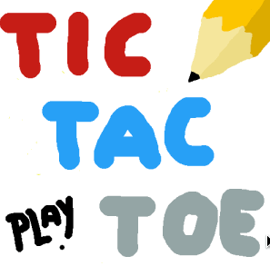

# graphical-tictactoe

Graphical TicTacToe is a cross-platform, animated tictactoe implementation written in C++ with Qt.
<br /><br />


<br /><br />

### To build, you need. . . 

* [The latest stable version of open-source Qt](https://www.qt.io/download-open-source?hsCtaTracking=9f6a2170-a938-42df-a8e2-a9f0b1d6cdce%7C6cb0de4f-9bb5-4778-ab02-bfb62735f3e5).
* A C++ compiler for your machine.
* qmake (included in Qt)
* make or nmake

After downloading and installing Qt, navigate to the root directory of this repository. From there, run the following commands to build the project:
```
qmake
make   // Unix-based
nmake  // Windows
```
<br />
Or, open the .pro file in Qt Creator (included in every installation of Qt), configure it using the latest version of Qt and the compiler of your choice, and build the project.
<br /><br /><br />


Graphical TicTacToe is licensed under the GNU General Public License v3.0

Copyright © 2020 Spencer Davis
